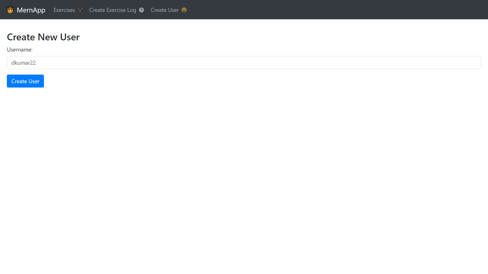
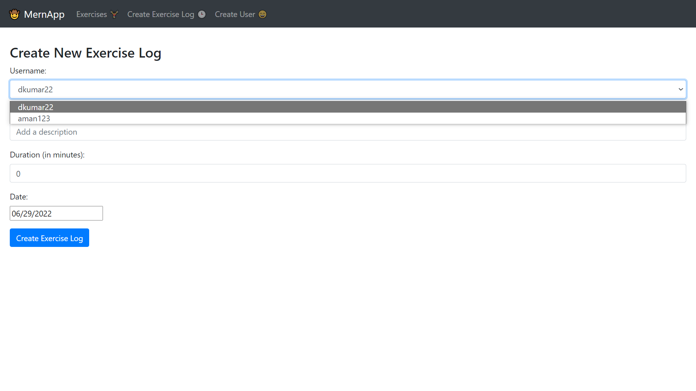
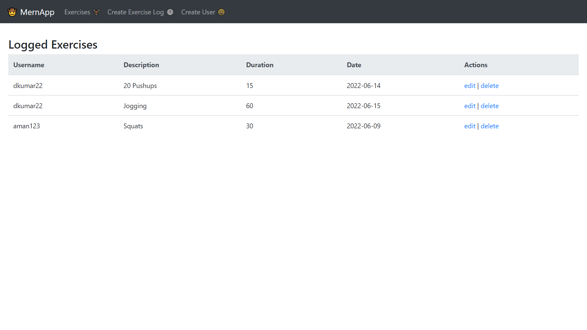

# Exercise Tracker Web App

### Deployed Link: https://unique-pithivier-0f06e5.netlify.app/

## Introduction

A web App through which user can keep track of the activities/exercise they want to perform. It stores user-wise activities along with the duration and date for the same to be performed

## Technologies Utilised

It is MERN based project using MongoDB for database management, a popular NoSQL database management software, we will be using ReactJS for designing the front end and Express and Node JS for designing the backend, thus making it as a full stack project.

## Database Description

Utilised MongoDB for storing the data. Used 5 MongoDB collections to store and use the data accordingly.

<ul>
<li>Exercises -Stores the Exercises to be done by different users.</li>
<li>Users -Stores the details of users.</li>
</ul>

Sneak Peak of the project

<b>Important Functionalities</b>

<b>User Creation</b>

<b>Make a new exercise entry</b>

<b>Viewing List of Exercises</b>

(User can add, edit or delete exercises through this page)